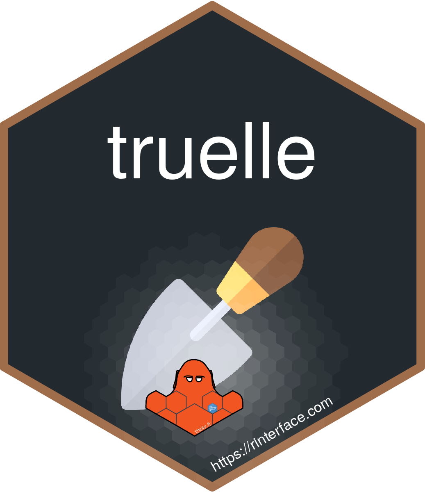
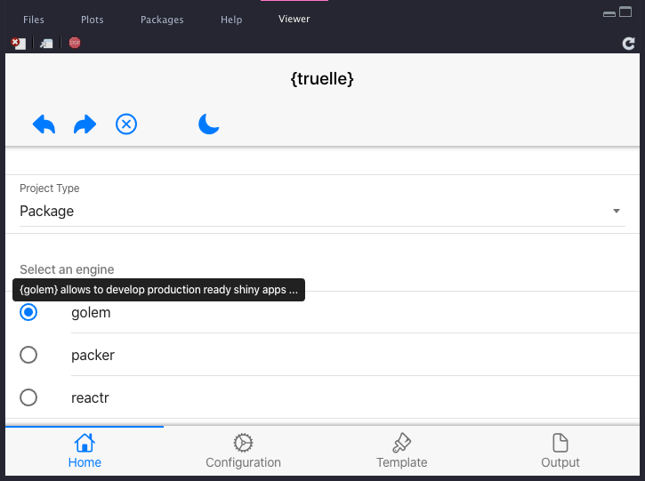
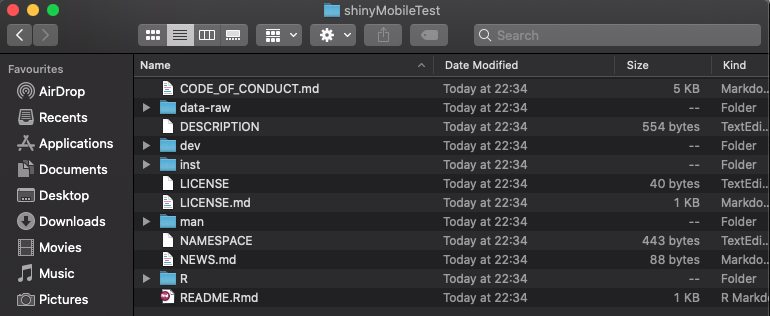
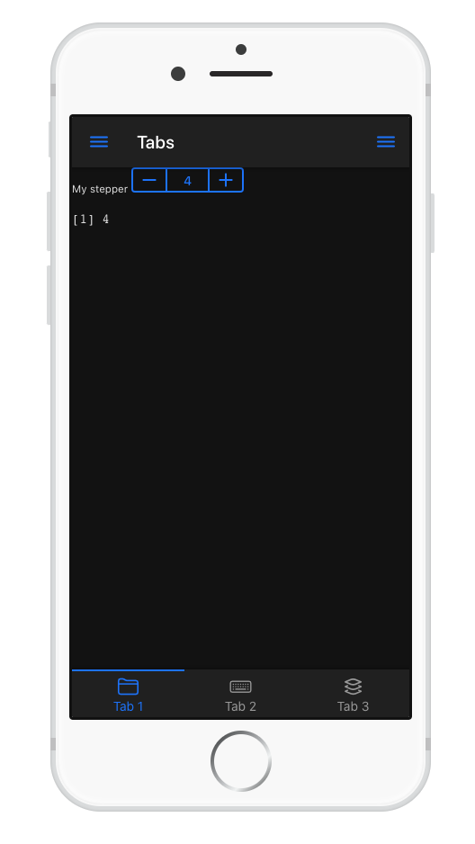
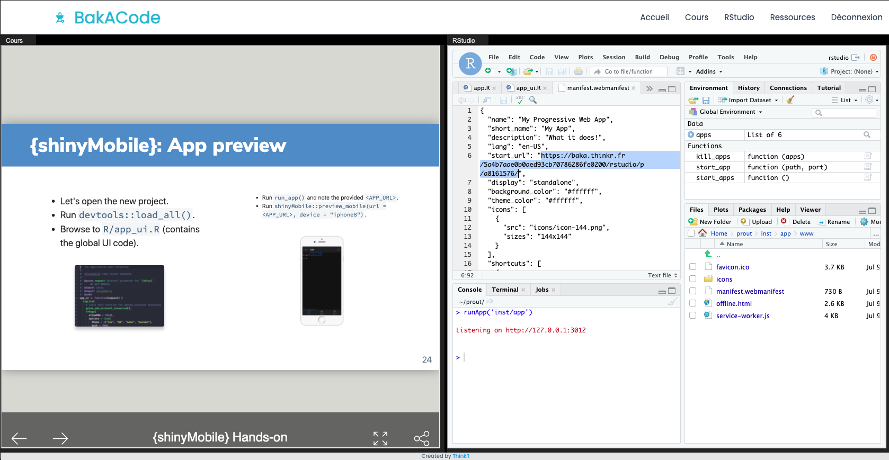
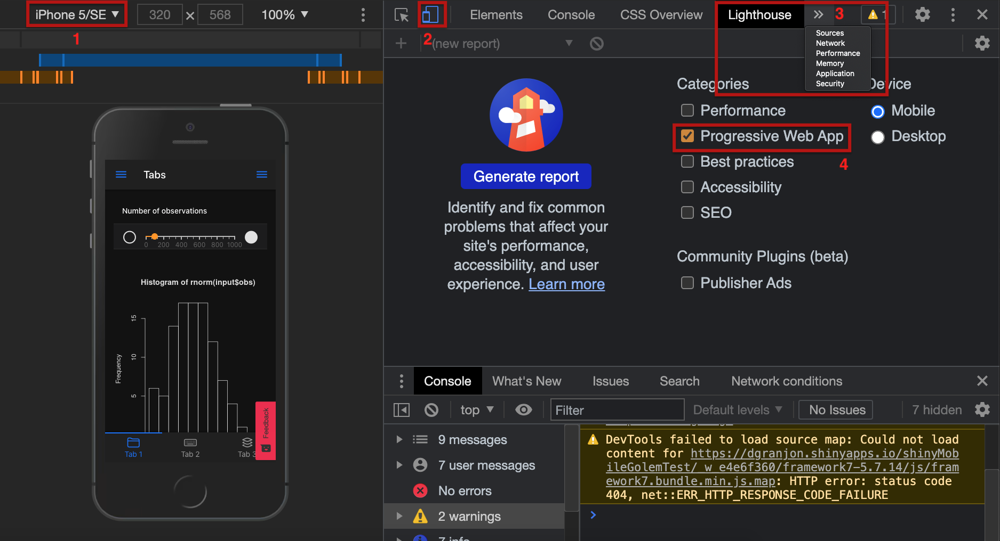
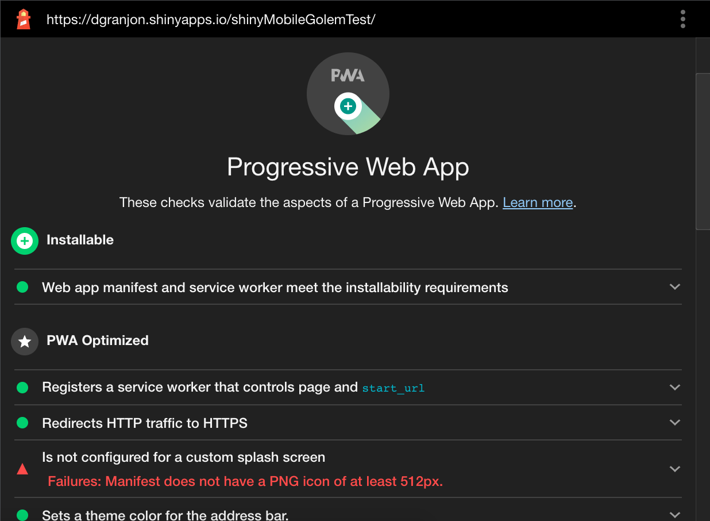
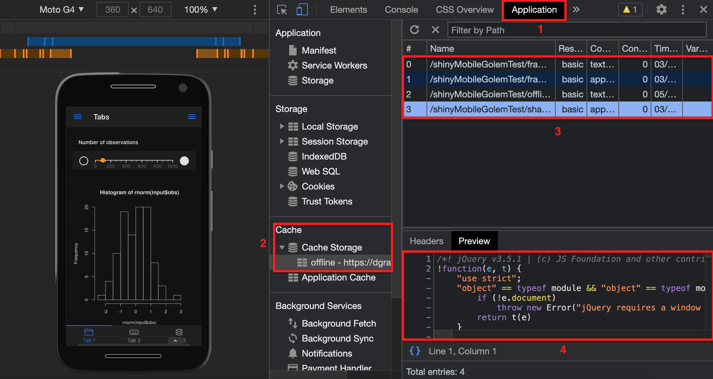
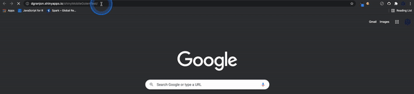
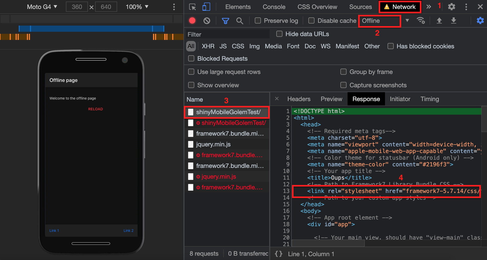

class: inverse, center, title-slide, middle


# {shinyMobile} Hands-on

## David Granjon

### `r Sys.Date()`
### Hosted by 

```{r setup, include=FALSE}
library(emo)
library(shiny)
library(countdown)
options(htmltools.dir.version = FALSE)
knitr::opts_chunk$set(
  fig.width = 10, fig.height = 6, fig.retina = 2,
  warning = FALSE, message = FALSE
)

#xaringanExtra::use_search(show_icon = TRUE)
xaringanExtra::use_tile_view()
xaringanExtra::use_share_again()
xaringanExtra::use_clipboard()
xaringanExtra::use_tachyons()
xaringanExtra::use_fit_screen()
xaringanExtra::use_panelset()

xaringanExtra::use_extra_styles(
  hover_code_line = TRUE,         #<<
  mute_unhighlighted_code = TRUE  #<<
)
```

```{r js4shiny, echo=FALSE}
js4shiny::html_setup(stylize = c("fonts", "variables", "code"))
```

---

# Hi there `r ji("pizza")`

We're in for 2 hours of **fun**!

- Grab a `r ji("coffee")`
- Make yourself comfortable `r ji("couch")` or 🧘
- Ask questions `r ji("question")` 

.flex.tc[
.w-30.mr3.center[

<br>
.f5[David]

.small[Senior Expert Data Scientist, Novartis]
]
]

---
# Program

.panelset[
.panel[.panel-name[Partie 1]
Mobile app development with `{shiny}`, `{golem}` et `{shinyMobile}`

Learning objectives:
- `r ji("teacher")` State of the art.
- `r ji("teacher")` `{shinyMobile}` introduction: components, templates, themes ...
- Setup a production app.
]

.panel[.panel-name[Partie 2]
Discover progressive web apps (PWA) and create a simple example, built on top the previous part. 

Learning objectives:
- Discover what is a progressive web app.
- Step by step development.
- Overview of what are the next steps and limitations. 

]
]

---
# Workshop Material

- [Slides](https://github.com/RinteRface/rencontresR2021).
- Sandbox [app](https://dgranjon.shinyapps.io/shinyMobileGolemTest/).
- Book "Outstanding user Interfaces with Shiny": [intro](https://unleash-shiny.rinterface.com/mobile-shiny-intro.html) and [pwa](https://unleash-shiny.rinterface.com/mobile-pwa.html). 

## Prerequisites
- Preliminary experience with `{shiny}`.
- Basic knowledge about R packages may help. 
- Be curious. 

---
class: inverse center title-slide middle
# Part 1.1 Introduction to {shinyMobile}


---
class: header_background
# Mobile development

<br/>
## Classic web apps are not optimized for mobile platforms.

  - Rarely consider the __small display__.
  - Harder to access (no launch icon).
  - Harder to focus if __not fullscreen__. 
  - Don't work __offline__.

<br/>
--
.center[
Appearance is critical for end user. `r emo::ji("beauty")`
]  

---
class: header_background
# Mobile development

<br/>
##`r emo::ji("smiling_imp")` Let's go __native__! 

Well ... it's quite complex:

  - Know multiple languages: Java, Swift, ...
  - Maintain multiple code bases.

<br/>
--
.center[
`r emo::ji("question")` Isn't there something simpler? 
]

---
class: header_background
# Progressive web apps (PWA)

<br/>
## Take some advantages of both worlds:

  - Can be __installed__ on the device ... 
  - ... But run via a web browser.
  - Provide __offline__ features (don't expect too much).
  - One code base (web languages).

<br/>
--
.center[
`r emo::ji("sad")` Less performance than native. 
]

---
class: header_background 
# Mobile app development and {shiny}?

<br/>
Let's be honest, there is __almost nothing__ `r emo::ji("sob")`.

.pull-left[
- Many shiny apps are not optimized for mobile. 
- Vertical design.
- Overflow.
- Poor user experience.
]
  
.pull-right[

```{r, echo = FALSE, out.width='50%', fig.align='center'}
knitr::include_url("https://thiago-valentim.shinyapps.io/project/?_ga=2.187989743.677910734.1623617328-748932920.1610966288", height = "300px")
```
]

---
class: header_background 
# Mobile app development and {shiny}?

<br/>
`{miniUI}` exists but not really for mobile development.

```{r, echo = FALSE, out.width='40%', fig.align='center'}
knitr::include_graphics("assets/images/gadgets-tabstrip.png")
```


---
class: header_background 
# Welcome {shinyMobile}? 

<br/>
Built on top of the [Framework7](https://framework7.io/) web framework.

.pull-left[
- Native look and feel for iOS and Android
- PWA support.
- ... also works for desktop apps 😏
]

.pull-right[

]

---
# Key features: Layout

<script>
$('#singleLayout').prop('checked', true);
  $('#singleLayout, #tabsLayout').on('click', function() {
    $('#singleLayoutDemo').toggle();
    $('#tabLayoutDemo').toggle();
  });
</script>

.pull-left[
- `f7SingleLayout()`: one page app. 
- `f7TabLayout()`: multi-tabs app.
<br/>
<br/>

<div class="form-check form-check-inline">
  <input class="form-check-input" type="radio" name="layoutRadio" id="singleLayout">
  <label class="form-check-label" for="singleLayout">single</label>
</div>
<div class="form-check form-check-inline">
  <input class="form-check-input" type="radio" name="layoutRadio" id="tabsLayout">
  <label class="form-check-label" for="tabsLayout">Tabs</label>
</div>
]

.pull-right[
<div class="md-iphone-5 md-black-device" id="singleLayoutDemo" style="font-size: 0.5em; margin-top: -50px !important;">
<div class="md-body">
<div class="md-buttons"></div>
<div class="md-front-camera"></div>
<div class="md-top-speaker"></div>
<div class="md-screen">
<iframe width="100%" src="https://connect.thinkr.fr/shinyMobile1/" allowfullscreen="" frameborder="0" scrolling="no" height="470px"></iframe>
</div>
<button class="md-home-button"></button>
</div>
</div>

<div class="md-iphone-5 md-white-device" id="tabLayoutDemo" style="font-size: 0.5em; margin-top: -50px !important; display: none;">
<div class="md-body">
<div class="md-buttons"></div>
<div class="md-front-camera"></div>
<div class="md-top-speaker"></div>
<div class="md-screen">
<iframe width="100%" src="https://connect.thinkr.fr/shinyMobile2/" allowfullscreen="" frameborder="0" scrolling="no" height="470px"></iframe>
</div>
<button class="md-home-button"></button>
</div>
</div>

]

---
# Key features: Skins

<script>
  $('#skiniOS').prop('checked', true);
  $('#skiniOS, #skinMd').on('click', function() {
    $('#skiniOSDemo').toggle();
    $('#skinMdDemo').toggle();
  });
</script>

.pull-left[
- iOS.
- Android.

<br/>
<br/>

<div class="form-check form-check-inline">
  <input class="form-check-input" type="radio" name="skinRadio" id="skiniOS">
  <label class="form-check-label" for="skiniOS">iOS</label>
</div>
<div class="form-check form-check-inline">
  <input class="form-check-input" type="radio" name="skinRadio" id="skinMd">
  <label class="form-check-label" for="skinMd">md</label>
</div>

]

.pull-right[
<div class="md-iphone-5 md-white-device" id="skiniOSDemo" style="font-size: 0.5em; margin-top: -50px !important;">
<div class="md-body">
<div class="md-buttons"></div>
<div class="md-front-camera"></div>
<div class="md-top-speaker"></div>
<div class="md-screen">
<iframe width="100%" src="https://connect.thinkr.fr/shinyMobile3/" allowfullscreen="" frameborder="0" scrolling="no" height="470px"></iframe>
</div>
<button class="md-home-button"></button>
</div>
</div>

<div class="md-iphone-5 md-white-device" id="skinMdDemo" style="font-size: 0.5em; margin-top: -50px !important; display: none;">
<div class="md-body">
<div class="md-buttons"></div>
<div class="md-front-camera"></div>
<div class="md-top-speaker"></div>
<div class="md-screen">
<iframe width="100%" src="https://connect.thinkr.fr/shinyMobile4/" allowfullscreen="" frameborder="0" scrolling="no" height="470px"></iframe>
</div>
<button class="md-home-button"></button>
</div>
</div>
]


---
# Key features: Themes
<script>
$('#skiniOS').prop('checked', true);
$('#themeSwitcher').on('click', function() {
  $('#darkThemeDemo').toggle();
  $('#whiteThemeDemo').toggle();
});
</script>

.pull-left[
2 themes:
<div class="form-check form-switch">
  <input class="form-check-input" type="checkbox" id="themeSwitcher">
  <label class="form-check-label" for="themeSwitcher">Default switch checkbox input</label>
</div>
]

.pull-right[
<div class="md-iphone-5 md-white-device" id="darkThemeDemo" style="font-size: 0.5em; margin-top: -50px !important;">
<div class="md-body">
<div class="md-buttons"></div>
<div class="md-front-camera"></div>
<div class="md-top-speaker"></div>
<div class="md-screen">
<iframe width="100%" src="https://connect.thinkr.fr/shinyMobile5/" allowfullscreen="" frameborder="0" scrolling="no" height="470px"></iframe>
</div>
<button class="md-home-button"></button>
</div>
</div>

<div class="md-iphone-5 md-black-device" id="whiteThemeDemo" style="font-size: 0.5em; margin-top: -50px !important; display: none;">
<div class="md-body">
<div class="md-buttons"></div>
<div class="md-front-camera"></div>
<div class="md-top-speaker"></div>
<div class="md-screen">
<iframe width="100%" src="https://connect.thinkr.fr/shinyMobile6/" allowfullscreen="" frameborder="0" scrolling="no" height="470px"></iframe>
</div>
<button class="md-home-button"></button>
</div>
</div>
]

---
# Demo app: {deminR}

.pull-left[
- {deminR}, 2020 Shiny Contest.
- https://dgranjon.shinyapps.io/deminR
- https://github.com/DivadNojnarg/deminR

<div class="row">
<div class="col">

</div>
<div class="col">

</div>
</div>
]

.pull-right[
<div class="md-iphone-5 md-black-device" id="deminR" style="font-size: 0.5em; margin-top: -50px !important;">
<div class="md-body">
<div class="md-buttons"></div>
<div class="md-front-camera"></div>
<div class="md-top-speaker"></div>
<div class="md-screen">
<iframe width="100%" src="https://dgranjon.shinyapps.io/deminR" allowfullscreen="" frameborder="0" scrolling="no" height="470px"></iframe>
</div>
<button class="md-home-button"></button>
</div>
</div>
]


---
class: center middle
# Your turn `r emo::ji("experiment")`! 

```{r, echo = FALSE, out.width='40%', fig.align='center'}
knitr::include_graphics("assets/images/excited-minions.gif")
```


---
class: inverse center title-slide middle
# Part 1.2 Project setup


---
class: header_background
# Initialize the project: {truelle}

<br/>

## We'll be using {golem} ...

.pull-left[

]
.pull-right[

]

--

## ... {truelle} is a {golem} GUI generator `r emo::ji("wizard")`! 

1. Open the RStudio Server.
2. Run `truelle::run_app()`.
3. Follow the steps.

---
class: header_background
# {truelle}: project type

<br/>

Select __Package__ and choose the `{golem}` engine.

```{r, echo = FALSE, fig.show="hold", out.width="50%"}
knitr::include_graphics("assets/images/truelle-project-type.png")

```

---
class: header_background
# {truelle}: Package options

<br/>

Provide a valid package path and review project options.

```{r, echo = FALSE, out.width='50%', fig.align='center'}
knitr::include_graphics("assets/images/truelle-package-options.png")
```

---
class: header_background
# {truelle}: UI template

<br/>

Select `{shinyMobile}` tabs layout. 

```{r, echo = FALSE, out.width='50%', fig.align='center'}
knitr::include_graphics("assets/images/truelle-ui-template.png")
```

---
class: header_background
# {truelle}: Run the output and enjoy `r emo::ji("sunglasses")`!

<br/>

Click on the `r emo::ji("play")` button or copy/paste `r emo::ji("photo")` the code to your terminal...

```{r, echo = FALSE, fig.show="hold", out.width="50%"}
knitr::include_graphics("assets/images/truelle-output.png")

```

Congrats `r emo::ji("party")`! We now have a production ready `{shinyMobile}` project.

---
class: inverse center title-slide middle
# Part 1.3 {shinyMobile}'s main features

---
class: header_background
# {shinyMobile}: App preview

<br/>

## Your turn `r emo::ji("experiment")`

.pull-left[
- `{shinyMobile}` allows app preview (local or remote).
- __Remote__ preview:
```{r, eval=FALSE}
shinyMobile::preview_mobile(
  url = "https://connect.thinkr.fr/shinyMobile1/", 
  device = "iphone8"
)
```
]

--
.xsmall.pull-right[
- Open the new project.
- Run `devtools::load_all()`.
- Run the app in a separate R process (only works with __local__ RStudio):

```{r, eval=FALSE}
processx::process$new(
  "Rscript",
  c("-e",
    sprintf(
      "thematic::thematic_shiny();
      shiny::runApp('%s', port = %s)",
      "./inst/app", 3434
    )
  )
)
shinyMobile::preview_mobile(
  url = "http://localhost:3434", 
  device = "iphone8"
)
```


.center[

]
]

---
class: header_background
# {shiny} VS {shinyMobile}: Main UI wrapper

<br>

.pull-left[


.small[
```{r, eval=FALSE}
library(shiny)

ui <- fluidPage(
  # ui logic
)

server <- function(input, output, session) {
  # server logic
}

shinyApp(ui, server)
```
]

]

--

.pull-right[


.small[
```{r, eval=FALSE}
library(shiny)
library(shinyMobile) #<<

ui <- f7Page( #<<
  # shinyMobile layout functions
)

server <- function(input, output, session) {
  # server logic
}

shinyApp(ui, server)
```
]

]

---
class: header_background
# {shinyMobile}: app options

<br/>

.small.pull-left[
- `f7Page()` exposes an __options__ parameter.
- Fine tune the app __appearance__ and __behavior__:
  - Theme, colors, ...
  - Dark mode (default to TRUE).
  - __tapHold__ (WHAAAAT???).
  - navbar and toolbar options.
  - ...
- Options inherited from [Framework7](https://v5.framework7.io/docs/app.html).
]

--

.small.pull-right[
## Your turn `r emo::ji("experiment")`
- Inspect the __./R/app_ui.R__ code and experiment with some of the options.
- Run `devtools::load_all()` and `run_app()`.
]

---
class: header_background
# {shinyMobile}: the tab layout

<br/>

.small.pull-left[
We leverage the `f7TabLayout()` function:

```{r, eval=FALSE}
f7TabLayout(..., navbar, messagebar = NULL, panels = NULL, appbar = NULL)
```

- __...__ are the tabs contained in `f7Tabs()`.
- `f7Tabs()` may host multiple `f7Tab()`.
- __navbar__ expects an `f7Navbar()`.
- We don't care about other parameters for now.
]

--

.small.pull-right[
## Your turn `r emo::ji("experiment")`
- Inspect the __./R/app_ui.R__ code and find the corresponding pieces.
- Add a new `f7Tab()` element. Hint: `f7Tab(..., tabName, icon = NULL, active = FALSE, hidden = FALSE)`. 
- Run `devtools::load_all()` and `run_app()`.
]


---
class: header_background
# {shinyMobile}: the navbar

<br/>

.small.pull-left[
`f7Navbar()`:

  - Contains __title__, __subtitle__.
  - Optional __subNavbar__ with `f7SubNavbar()`.
  - Other parameters offer cosmetic options:
    - shadow.
    - horizontal line.
    - transparent.
    - ...
]

--

.xsmall.pull-right[
## Your turn `r emo::ji("experiment")`
- In __./R/app_ui.R__, modify the navbar title.
- Add a subtitle.
- Add a `f7SubNavbar()` such as:

```{r, eval=FALSE}
f7SubNavbar(
  f7Button(label = "My button"),
  f7Button(label = "My button"),
  f7Button(label = "My button")
)
```

- Turn the __leftPanel__ and __rightPanel__ to `FALSE`.
- Set __hairline__ to `FALSE`. 
- Run `devtools::load_all()` and `run_app()`.

]

---
class: header_background
# {shinyMobile}: components

<br/>

.small.pull-left[
`{shinyMobile}` exposes many components:

  - Containers: `f7Card()`, `f7List()`, `f7Block()`, ...
  - Inputs: `f7Text()`, `f7Checkbox()`, `f7Toggle()`, ...
  - Notifications: `f7Notif()`, `f7Dialog()`, `f7ActionSheet()`, ...
  - Buttons: `f7Button()`, `f7TabLink()`, ...
  - Metric: `f7Gauge()`, `f7Progress()`, ...
  

Most of them can be updated server side!
]

--

.xsmall.pull-right[
## Your turn `r emo::ji("experiment")`
- In __./R/app_ui.R__, add a new `f7ExpandableCard()` in the previously added `f7Tab()`.
- Give it an __id__.
- Below the card add a `f7Button("openCard", "Click me!")`.
- In __./R/app_server.R__ add this code, replacing `<CARD_ID>`:

```{r, eval=FALSE}
observeEvent(input$openCard, {
  updateF7Card(id = <CARD_ID>)
})
```
- Run `devtools::load_all()` and `run_app()`.
]

---
class: end_part_1


---
class: inverse center title-slide middle
# Part 2.1 Introduction to PWA


---
class: header_background
# Progressive web apps

<br/>

Progressive web apps or (PWA) improve classic web apps capabilities by obeying these three rules:

1. Being __capable__: media control, file system access, …
2. Being __reliable__: fast and usable __offline__. Transparent failures.
3. Being __installable__: Standalone use, launch from user’s home screen.

In the following we'll treat 2 and 3.


---
class: header_background
# How can my app be installable?

<br/>

- The app must be served over __HTTPS__ (shinyapp.io, ...).
- Include a __manifest__, that is a JSON file specifying app metadata (name, icons, ...).
- Have a registered __service worker__, which can cache the app content and provide __offline__ support.

```{r, echo = FALSE, out.width='40%', fig.align='center'}
knitr::include_graphics("assets/images/alors_heureux.gif")
```


---
class: header_background
# What is a web manifest?

<br/>

A [JSON](https://web.dev/add-manifest/) file which can be interpreted by the web browser (Chrome, Safari, Firefox, Brave, ...).

.pull-left[
.xsmall[
```js
{
  "name": "My Progressive Web App",
  "short_name": "My App",
  "description": "What it does!",
  "lang": "en-US",
  "start_url": "https://dgranjon.shinyapps.io/shinyMobileGolemTest/",
  "display": "standalone",
  "background_color": "#ffffff",
  "theme_color": "#ffffff",
  "icons": [
    {
      "src": "icons/icon-144.png",
      "sizes": "144x144"
    }
  ],
  ...
}
```
]
]

.pull-right[
.small[
Most important fields:
- __start_url__: where your app is hosted.
- __display__: use __standalone__ for native look and feel. 
- __icon__: an array pointing to icons (useful for favicon, launch screen ...) in the `www` folder.

Check compatibility support [here](https://developer.mozilla.org/en-US/docs/Web/Manifest).
]
]

In a Shiny app context, the manifest goes in `www`. 

---
class: header_background
# The service worker
<br/>

Script run in the background by the web browser. 

.pull-left[
.xsmall[
```js
self.addEventListener("install", (event) => {
  event.waitUntil(
    (async () => {
      const cache = await caches.open(CACHE_NAME);
      // Setting {cache: 'reload'} in the new request will ensure that the
      // response isn't fulfilled from the HTTP cache; i.e., it will be from
      // the network.
      await cache.add( new Request(OFFLINE_URL, { cache: "reload" }) );
      await cache.add( new Request("framework7-5.7.14/css/framework7.bundle.min.css", { cache: "reload" }) );
      // add other resources to cache below
    })()
  );
  // Force the waiting service worker to become the active service worker.
  self.skipWaiting();
});
```
]
]

.pull-right[
.xsmall[
Features:

- Requires __HTTPS__.
- Able to store app resources (CSS, JS, images, HTML, ...) in the application cache ...
- ... Thereby making them available offline.
- Many plug and play template here and there. 

Script composed of 3 steps:

- Installation + cache configuration (see left code).
- Activation.
- Fetch requests (fill the cache, ...)
]
]

---
class: inverse center title-slide middle
# Part 2.2 Develop a PWA with {shinyMobile}

---
class: header_background
# Road to PWA : enable PWA

<br/>

Good new `r emo::ji("happy")`! 

--

`{shinyMobile}` is PWA ready `r emo::ji("sunglasses")`.

--

Just turn on the `allowPWA` to `TRUE` in `f7Page()`. Under the hood, it adds all the required machinery 🧙.


---
class: header_background
# Road to PWA : Modify {golem} package

<br/>

.small.pull-left[
## Your turn `r emo::ji("experiment")`
- Open `./R/app_ui.R`.
- Scroll down to the `golem_add_external_resources` function.
- Comment out the code as shown on the left (to avoid conflicts with `{shinyMobile}` PWA assets).
- Call `golem::add_ui_server_files()`.
]


.small.pull-right[
```{r, eval=FALSE}
golem_add_external_resources <- function(){
  
  #add_resource_path(
  #  'www', app_sys('app/www')
  #)
 
  tags$head(
    #favicon(),
    #bundle_resources(
    #  path = app_sys('app/www'),
    #  app_title = 'shinyexample'
    #)
    # Add here other external resources
    # for example, you can add shinyalert::useShinyalert() 
  )
}
```
]


---
class: header_background
# Road to PWA : add PWA files (1/2)

<br/>

Time consuming, need __automated__ approach... The below script:

--
.small[
.pull-left[
```{r, eval=FALSE}
# Important to target the app folder.
# Only work if app is in a package.
# register_service_worker is FALSE, shinyMobile already does it.
# We also don't need to create web dependencies. 
charpente::set_pwa(
  "inst/app", 
  register_service_worker = FALSE,
  create_dependencies = FALSE
)
```
]
]

--

.pull-right[
- Creates a __web manifest__.
- Adds a __service worker__.
- Adds placeholder icons (you may need to create your own later).
- Adds an __offline__ HTML template page.
]

---
class: header_background
# Road to PWA: add PWA files (2/2)

<br/>

.xsmall.pull-left[
## Your turn `r emo::ji("experiment")`
- Run `charpente::set_pwa("inst/app", register_service_worker = FALSE, create_dependencies = FALSE)` inside your project.
- Run `devtools::load_all()` and `run_app()`.
- Once the RStudio viewer opens, click on `Open in Browser`.
- Note the app <sup>URL</sup>: `https://baka.thinkr.fr/<CONTAINER_ID>/rstudio/p/<RSTUDIO_TOKEN>/`.
- Copy it in the `./inst/app/www/manifest.webmanifest` __start_url__ field. 
]

.pull-right[
<br/>
```{r, echo = FALSE, out.width='100%', fig.align='center'}

```
]


.xsmall.footnote[
This workshop is hosted by [ThinkR](https://thinkr.fr/) on a dedicated server. If you are working locally, first deploy your app to a secure server (with __HTTPS__ like [shinyapps.io](https://www.shinyapps.io/)). PWA features __don't work__ locally!!!
]


---
class: header_background
# Road to PWA: Check your app (1/3)

<br/>

.pull-left[
.small[
## Your turn `r emo::ji("experiment")`
- App is already running in Chrome.
- If __App does not work__: use `https://dgranjon.shinyapps.io/shinyMobileGolemTest`.
- Open the Chrome developer tools: ⌥ + ⌘ + I (Mac), ctrl + shift + I (windows).
- Follow the steps showed in the figure (in red).
- Click on `Generate report` and wait.
]
]

.pull-right[
<br/>
```{r, echo = FALSE, out.width='100%', fig.align='center'}

```
]


---
class: header_background
# Road to PWA: Check your app (2/3)

<br/>

We aim to see the __installable__ property in green.

```{r, echo = FALSE, out.width='50%', fig.align='center'}

```

---
class: header_background
# Road to PWA: Check your app (3/3)

<br/>

.pull-left[
## Your turn `r emo::ji("experiment")`
- Open the Chrome developer tools: ⌥ + ⌘ + I (Mac), ctrl + shift + I (windows).
- Follow the steps showed in the figure (in red).
- Check that `offline.html` and JS/CSS files are cached (necessary for offline support).
]

.pull-right[
<br/>
```{r, echo = FALSE, out.width='100%', fig.align='center'}

```
]

---
class: header_background
# Road to PWA : handle the installation

<br/>

.pull-left[
## Desktop
```{r, echo = FALSE, out.width='100%', fig.align='center'}

```
]


.pull-right[
## iOS
```{r, echo = FALSE, out.width='40%', fig.align='center'}
knitr::include_graphics("assets/images/pwa-install-ios.gif")
```
]


---
class: header_background
# Road to PWA: play around

<br/>

.pull-left[
## Your turn `r emo::ji("experiment")`
- Install the deployed app.
- Create a desktop shortcut.
- Launch the app.
- Emulate disabled network connection (Don't shutdown your wifi! See figure `r emo::ji("laugh")`).
- Reload the page and observe. 
- Re-activate internet and reload the app.
]

.pull-right[
<br/>
```{r, echo = FALSE, out.width='100%', fig.align='center'}

```
]

--

.xsmall[Installed apps can be accessed under `chrome://apps/`]

---
class: header_background
# Road to PWA: What's next?

<br/>

- Improve the offline HTML page.
- Take this [course](https://web.dev/progressive-web-apps/).
- PWA shortcuts (Windows, Android support). 


---
class: end_part_2