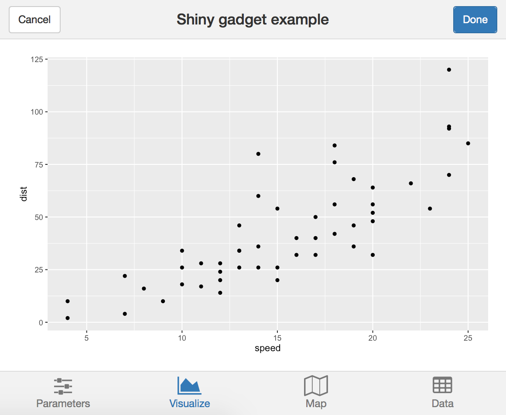

class: inverse, center, title-slide, middle


# {shinyMobile} Hands-on

## David Granjon

### `r Sys.Date()`

```{r setup, include=FALSE}
library(emo)
library(shiny)
library(countdown)
options(htmltools.dir.version = FALSE)
knitr::opts_chunk$set(
  fig.width = 10, fig.height = 6, fig.retina = 2,
  warning = FALSE, message = FALSE
)

#xaringanExtra::use_search(show_icon = TRUE)
xaringanExtra::use_tile_view()
xaringanExtra::use_share_again()
xaringanExtra::use_clipboard()
xaringanExtra::use_tachyons()

xaringanExtra::use_extra_styles(
  hover_code_line = TRUE,         #<<
  mute_unhighlighted_code = TRUE  #<<
)
xaringanExtra::use_panelset()
```

```{r js4shiny, echo=FALSE}
js4shiny::html_setup(stylize = c("fonts", "variables", "code"))
```

---

# Hi there `r ji("pizza")`

We're in for 2 hours of **fun**!

- Grab a `r ji("coffee")`
- Make yourself comfortable `r ji("couch")` or 🧘
- Ask questions `r ji("question")` 

.flex.tc[
.w-30.mr3.center[

<br>
.f5[David]

.small[Senior Expert Data Scientist, Novartis]
]
]

---
# Program

.panelset[
.panel[.panel-name[Partie 1]
Introduction au développement d'applications mobiles avec `{shiny}`, `{golem}` et `{shinyMobile}`

Learning objectives:
- `r ji("teacher")` Motivations: état de l'art.
- `r ji("teacher")` Présentation de `{shinyMobile}`: composants, templates, thèmes ...
- Création d'une application de production.
- `r ji("coffee")`
]

.panel[.panel-name[Partie 2]
Découvrir le monde des applications web progressives (PWA) et
mettre en place les bases sur un exemple concret. 

Learning objectives:
- Définition d'une application web progressive.
- Mise en place.
- `r ji("coffee")`

]
]

---
# Workshop Material

- Slides: TBD ...

## Prerequisites
- ...

---
class: inverse center title-slide middle
# Part 1 Introduction to {shinyMobile}


---
class: header_background
# Développement mobile
Classic web apps are not optimized for mobile platforms:
  - Rarely consider the small display.
  - Harder to access (no launch icon).
  - Harder to focus if not fullscreen. 
  - Don't work offline.

.center[
Appearance is critical for end user. `r emo::ji("beauty")`
]  

---
class: header_background
# Développement mobile
`r emo::ji("smiling_imp")` Let's go native!

Well ... it's quite complex:

  - Know multiple languages: Java, Swift, ...
  - Maintain multiple code bases.

.center[
`r emo::ji("question")` Isn't there something simpler? 
]

---
class: header_background
# Applications web progressives

Take some advantages of both worlds:

  - Can be installed on the device ... 
  - ... But run via a web browser.
  - Provide offline features (don't expect too much).
  - One code base (web languages).

`r emo::ji("car")` Less performance than native. 

---
class: header_background 
# Développement mobile et {shiny}?

- Let's be honest, there is almost nothing...
- `{miniUI}` is not really for mobile development.
- Many shiny apps are not optimized for mobile. 

```{r, echo = FALSE, out.width='40%', fig.align='center'}

```

---
class: header_background 
# What is {shinyMobile}? 


---
class: header_background
# Demo

Explore `{shinyMobile}` capabilities.

TBD


--- 
class: header_background
# Other templates
OnsenUI 2, ...


---
class: inverse center title-slide middle
# Part 2 Introduction to PWA with {shinyMobile}