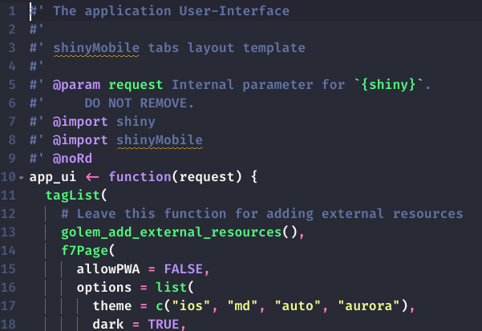

class: inverse, center, title-slide, middle


# {shinyMobile} Hands-on

## David Granjon

### `r Sys.Date()`

```{r setup, include=FALSE}
library(emo)
library(shiny)
library(countdown)
options(htmltools.dir.version = FALSE)
knitr::opts_chunk$set(
  fig.width = 10, fig.height = 6, fig.retina = 2,
  warning = FALSE, message = FALSE
)

#xaringanExtra::use_search(show_icon = TRUE)
xaringanExtra::use_tile_view()
xaringanExtra::use_share_again()
xaringanExtra::use_clipboard()
xaringanExtra::use_tachyons()
xaringanExtra::use_fit_screen()
xaringanExtra::use_panelset()

xaringanExtra::use_extra_styles(
  hover_code_line = TRUE,         #<<
  mute_unhighlighted_code = TRUE  #<<
)

# dark_demo_app <- processx::process$new(
#   "Rscript", 
#   c(
#     "-e",  
#     "thematic::thematic_shiny();
#      shiny::runApp('./assets/R/dark-demo', port = 3515)"
#   )
# )
# 
# Sys.sleep(2)
# 
# white_demo_app <- processx::process$new(
#   "Rscript", 
#   c(
#     "-e",  
#     "shiny::runApp('./assets/R/white-demo', port = 3516)"
#   )
# )
# 
# Sys.sleep(2)

```

```{r js4shiny, echo=FALSE}
js4shiny::html_setup(stylize = c("fonts", "variables", "code"))
```

---

# Hi there `r ji("pizza")`

We're in for 2 hours of **fun**!

- Grab a `r ji("coffee")`
- Make yourself comfortable `r ji("couch")` or 🧘
- Ask questions `r ji("question")` 

.flex.tc[
.w-30.mr3.center[

<br>
.f5[David]

.small[Senior Expert Data Scientist, Novartis]
]
]

---
# Program

.panelset[
.panel[.panel-name[Partie 1]
Mobile app development with `{shiny}`, `{golem}` et `{shinyMobile}`

Learning objectives:
- `r ji("teacher")` State of the art.
- `r ji("teacher")` `{shinyMobile}` introduction: components, templates, themes ...
- Setup a production app.
- `r ji("coffee")`
]

.panel[.panel-name[Partie 2]
Discover progressive web apps (PWA) and create a simple example, built on top the previous part. 

Learning objectives:
- What is a progressive web app?
- Step by step development.
- `r ji("coffee")`

]
]

---
# Workshop Material

- Slides: TBD ...

## Prerequisites
- ...

---
class: inverse center title-slide middle
# Part 1 Introduction to {shinyMobile}


---
class: header_background
# Mobile development

<br/>
## Classic web apps are not optimized for mobile platforms.

  - Rarely consider the __small display__.
  - Harder to access (no launch icon).
  - Harder to focus if __not fullscreen__. 
  - Don't work __offline__.

.center[
Appearance is critical for end user. `r emo::ji("beauty")`
]  

---
class: header_background
# Mobile development

<br/>
##`r emo::ji("smiling_imp")` Let's go __native__! 

Well ... it's quite complex:

  - Know multiple languages: Java, Swift, ...
  - Maintain multiple code bases.

.center[
`r emo::ji("question")` Isn't there something simpler? 
]

---
class: header_background
# Progressive web apps

<br/>
## Take some advantages of both worlds:

  - Can be __installed__ on the device ... 
  - ... But run via a web browser.
  - Provide __offline__ features (don't expect too much).
  - One code base (web languages).

`r emo::ji("sad")` Less performance than native. 

---
class: header_background 
# Mobile app development and {shiny}?

<br/>
Let's be honest, there is __almost nothing__.

.pull-left[
- Many shiny apps are not optimized for mobile. 
- Vertical design.
- Overflow.
- Poor user experience.
]
  
.pull-right[

```{r, echo = FALSE, out.width='50%', fig.align='center'}
knitr::include_url("https://thiago-valentim.shinyapps.io/project/?_ga=2.187989743.677910734.1623617328-748932920.1610966288", height = "300px")
```
]

---
class: header_background 
# Mobile app development and {shiny}?

<br/>
`{miniUI}` exists but not really for mobile development.

```{r, echo = FALSE, out.width='40%', fig.align='center'}
knitr::include_graphics("assets/images/gadgets-tabstrip.png")
```


---
class: header_background 
# Welcome {shinyMobile}? 

<br/>
Built on top of the [Framework7](https://framework7.io/) web framework.

.pull-left[
- Native look and feel.
- PWA support.
- ...
]

.pull-right[

]

---
class: header_background 
# Key features

- Layout
- Skins
- Themes
- Components
- ...


---
# Key features: Layout

<script>
$('#singleLayout').prop('checked', true);
  $('#singleLayout, #tabsLayout').on('click', function() {
    $('#singleLayoutDemo').toggle();
    $('#tabLayoutDemo').toggle();
  });
</script>

.pull-left[
- `f7SingleLayout()`: one page app. 
- `f7TabLayout()`: multi-tabs app.
<br/>
<br/>

<div class="form-check form-check-inline">
  <input class="form-check-input" type="radio" name="layoutRadio" id="singleLayout">
  <label class="form-check-label" for="singleLayout">single</label>
</div>
<div class="form-check form-check-inline">
  <input class="form-check-input" type="radio" name="layoutRadio" id="tabsLayout">
  <label class="form-check-label" for="tabsLayout">Tabs</label>
</div>
]

.pull-right[
<div class="md-iphone-5 md-black-device" id="singleLayoutDemo" style="font-size: 0.5em; margin-top: -50px !important;">
<div class="md-body">
<div class="md-buttons"></div>
<div class="md-front-camera"></div>
<div class="md-top-speaker"></div>
<div class="md-screen">
<iframe width="100%" src="https://dgranjon.shinyapps.io/miniUI2Single" allowfullscreen="" frameborder="0" scrolling="no" height="470px"></iframe>
</div>
<button class="md-home-button"></button>
</div>
</div>

<div class="md-iphone-5 md-black-device" id="tabLayoutDemo" style="font-size: 0.5em; margin-top: -50px !important; display: none;">
<div class="md-body">
<div class="md-buttons"></div>
<div class="md-front-camera"></div>
<div class="md-top-speaker"></div>
<div class="md-screen">
<iframe width="100%" src="https://dgranjon.shinyapps.io/miniUI2Tabs" allowfullscreen="" frameborder="0" scrolling="no" height="470px"></iframe>
</div>
<button class="md-home-button"></button>
</div>
</div>

]

---
# Key features: Skins

<script>
  $('#skiniOS').prop('checked', true);
  $('#skiniOS, #skinMd').on('click', function() {
    $('#skiniOSDemo').toggle();
    $('#skinMdDemo').toggle();
  });
</script>

.pull-left[
- iOS.
- Android.

<br/>
<br/>

<div class="form-check form-check-inline">
  <input class="form-check-input" type="radio" name="skinRadio" id="skiniOS">
  <label class="form-check-label" for="skiniOS">iOS</label>
</div>
<div class="form-check form-check-inline">
  <input class="form-check-input" type="radio" name="skinRadio" id="skinMd">
  <label class="form-check-label" for="skinMd">md</label>
</div>

]

.pull-right[
<div class="md-iphone-5 md-black-device" id="skiniOSDemo" style="font-size: 0.5em; margin-top: -50px !important;">
<div class="md-body">
<div class="md-buttons"></div>
<div class="md-front-camera"></div>
<div class="md-top-speaker"></div>
<div class="md-screen">
<iframe width="100%" src="https://dgranjon.shinyapps.io/miniUI2Demo" allowfullscreen="" frameborder="0" scrolling="no" height="470px"></iframe>
</div>
<button class="md-home-button"></button>
</div>
</div>

<div class="md-iphone-5 md-black-device" id="skinMdDemo" style="font-size: 0.5em; margin-top: -50px !important; display: none;">
<div class="md-body">
<div class="md-buttons"></div>
<div class="md-front-camera"></div>
<div class="md-top-speaker"></div>
<div class="md-screen">
<iframe width="100%" src="https://dgranjon.shinyapps.io/miniUI2DemoMd" allowfullscreen="" frameborder="0" scrolling="no" height="470px"></iframe>
</div>
<button class="md-home-button"></button>
</div>
</div>
]


---
# Key features: Themes
<script>
$('#skiniOS').prop('checked', true);
$('#themeSwitcher').on('click', function() {
  $('#darkThemeDemo').toggle();
  $('#whiteThemeDemo').toggle();
});
</script>

.pull-left[
2 themes:
<div class="form-check form-switch">
  <input class="form-check-input" type="checkbox" id="themeSwitcher">
  <label class="form-check-label" for="themeSwitcher">Default switch checkbox input</label>
</div>
]

.pull-right[
<div class="md-iphone-5 md-white-device" id="darkThemeDemo" style="font-size: 0.5em; margin-top: -50px !important;">
<div class="md-body">
<div class="md-buttons"></div>
<div class="md-front-camera"></div>
<div class="md-top-speaker"></div>
<div class="md-screen">
<iframe width="100%" src="http://127.0.0.1:3515" allowfullscreen="" frameborder="0" scrolling="no" height="470px"></iframe>
</div>
<button class="md-home-button"></button>
</div>
</div>

<div class="md-iphone-5 md-black-device" id="whiteThemeDemo" style="font-size: 0.5em; margin-top: -50px !important; display: none;">
<div class="md-body">
<div class="md-buttons"></div>
<div class="md-front-camera"></div>
<div class="md-top-speaker"></div>
<div class="md-screen">
<iframe width="100%" src="http://127.0.0.1:3516" allowfullscreen="" frameborder="0" scrolling="no" height="470px"></iframe>
</div>
<button class="md-home-button"></button>
</div>
</div>
]

---
# Demo app: {deminR}

.pull-left[
- {deminR}, 2020 Shiny Contest.
- https://dgranjon.shinyapps.io/deminR
- https://github.com/DivadNojnarg/deminR

<div class="row">
<div class="col">

</div>
<div class="col">

</div>
</div>
]

.pull-right[
<div class="md-iphone-5 md-black-device" id="deminR" style="font-size: 0.5em; margin-top: -50px !important;">
<div class="md-body">
<div class="md-buttons"></div>
<div class="md-front-camera"></div>
<div class="md-top-speaker"></div>
<div class="md-screen">
<iframe width="100%" src="https://dgranjon.shinyapps.io/deminR" allowfullscreen="" frameborder="0" scrolling="no" height="470px"></iframe>
</div>
<button class="md-home-button"></button>
</div>
</div>
]


---
# Do you want more? 

---
class: header_background
# Initialize the project: {truelle}

## We'll be using {golem} ...

.center[

]

--

## ... {truelle} is a {golem} GUI generator `r emo::ji("wizard")`! 

1. Open the RStudio Server.
2. Run `truelle::run_app()`.
3. Follow the steps.

---
class: header_background
# {truelle}: project type

Select __Package__ and choose the `{golem}` engine.

```{r, echo = FALSE, fig.show="hold", out.width="50%"}
knitr::include_graphics("assets/images/truelle-project-type.png")
knitr::include_graphics("assets/images/truelle-project-engine.png")
```

---
class: header_background
# {truelle}: Package options

Provide a valid package path and review project options.

```{r, echo = FALSE, out.width='50%', fig.align='center'}
knitr::include_graphics("assets/images/truelle-package-options.png")
```

---
class: header_background
# {truelle}: UI template

Select `{shinyMobile}` tabs layout. 

```{r, echo = FALSE, out.width='50%', fig.align='center'}
knitr::include_graphics("assets/images/truelle-ui-template.png")
```

---
class: header_background
# {truelle}: Run the output and enjoy `r emo::ji("sunglasses")`!

Click on the `r emo::ji("play")` button or copy/paste `r emo::ji("photo")` the code to your terminal...

```{r, echo = FALSE, fig.show="hold", out.width="50%"}
knitr::include_graphics("assets/images/truelle-output.png")
knitr::include_graphics("assets/images/golem-package-structure.png")
```

Congrats `r emo::ji("party")`! We now have a production ready `{shinyMobile}` project.

---
class: header_background
# {shinyMobile}: App preview

.pull-left[
- Let's open the new project.
- Run `devtools::load_all()`.
- Browse to `R/app_ui.R` (contains the global UI code).

```{r, echo = FALSE, out.width='50%', fig.align='center'}

```
]

--
.small.pull-right[
- Run `run_app()` and note the provided __<APP_URL>__.
- Run `shinyMobile::preview_mobile(url = <APP_URL>, device = "iphone8")`.


.center[

]
]

---
class: header_background
# {shiny} VS {shinyMobile}: Main UI wrapper

<br>

.pull-left[


.small[
```{r, eval=FALSE}
library(shiny)

ui <- fluidPage(
  # ui logic
)

server <- function(input, output, session) {
  # server logic
}

shinyApp(ui, server)
```
]

]

.pull-right[


.small[
```{r, eval=FALSE}
library(shiny)
library(shinyMobile) #<<

ui <- f7Page( #<<
  # shinyMobile layout functions
)

server <- function(input, output, session) {
  # server logic
}

shinyApp(ui, server)
```
]

]

---
class: header_background
# {shinyMobile}: app options

.pull-left[
- `f7Page()` exposes an __options__ parameter.
- Fine tune the app __appearance__ and __behavior__:
  - Theme, colors, ...
  - Dark mode (default to TRUE).
  - __tapHold__ (WHAAAAT???).
  - navbar and toolbar options 
  - ...
- Options inherited from [Framework7](https://v5.framework7.io/docs/app.html).
]

--

.pull-right[
## Your turn. 
- Inspect the __app_ui.R__ code and experiment with some of the options.
- Run `devtools::load_all()`.
- Run `shinyMobile::preview_mobile(url = <APP_URL>, device = "iphone8")`.
]

`r countdown::countdown(2)`


---
class: header_background
# {shinyMobile}: the tab layout

.pull-left[
We leverage the `f7TabLayout()` function:

```{r, eval=FALSE}
f7TabLayout(..., navbar, messagebar = NULL, panels = NULL, appbar = NULL)
```

- __navbar__ expects an `f7Navbar()`.
- __...__ are the tabs `f7Tab()`.
- We don't care about other parameters for now.
]

--

.pull-right[
## Your turn
- Inspect the __app_ui.R__ code ...
]


---
class: inverse center title-slide middle
# Part 2 Introduction to PWA with {shinyMobile}