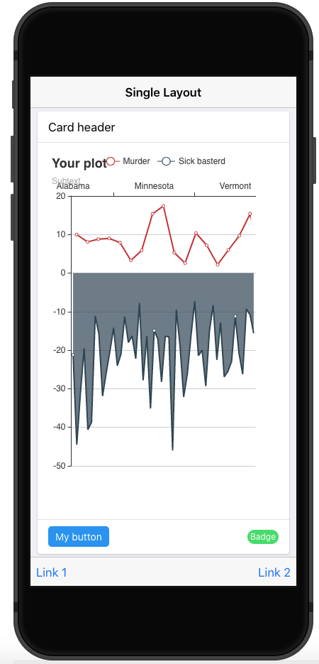

class: inverse, center, title-slide, middle


# {shinyMobile} Hands-on

## David Granjon

### `r Sys.Date()`

```{r setup, include=FALSE}
library(emo)
library(shiny)
library(countdown)
options(htmltools.dir.version = FALSE)
knitr::opts_chunk$set(
  fig.width = 10, fig.height = 6, fig.retina = 2,
  warning = FALSE, message = FALSE
)

#xaringanExtra::use_search(show_icon = TRUE)
xaringanExtra::use_tile_view()
xaringanExtra::use_share_again()
xaringanExtra::use_clipboard()
xaringanExtra::use_tachyons()

xaringanExtra::use_extra_styles(
  hover_code_line = TRUE,         #<<
  mute_unhighlighted_code = TRUE  #<<
)
xaringanExtra::use_panelset()
```

```{r js4shiny, echo=FALSE}
js4shiny::html_setup(stylize = c("fonts", "variables", "code"))
```

---

# Hi there `r ji("pizza")`

We're in for 2 hours of **fun**!

- Grab a `r ji("coffee")`
- Make yourself comfortable `r ji("couch")` or 🧘
- Ask questions `r ji("question")` 

.flex.tc[
.w-30.mr3.center[

<br>
.f5[David]

.small[Senior Expert Data Scientist, Novartis]
]
]

---
# Program

.panelset[
.panel[.panel-name[Partie 1]
Mobile app development with `{shiny}`, `{golem}` et `{shinyMobile}`

Learning objectives:
- `r ji("teacher")` State of the art.
- `r ji("teacher")` `{shinyMobile}` introduction: components, templates, themes ...
- Setup a production app.
- `r ji("coffee")`
]

.panel[.panel-name[Partie 2]
Discover progressive web apps (PWA) and create a simple example, built on top the previous part. 

Learning objectives:
- What is a progressive web app?
- Step by step development.
- `r ji("coffee")`

]
]

---
# Workshop Material

- Slides: TBD ...

## Prerequisites
- ...

---
class: inverse center title-slide middle
# Part 1 Introduction to {shinyMobile}


---
class: header_background
# Mobile development

<br/>
## Classic web apps are not optimized for mobile platforms.

  - Rarely consider the __small display__.
  - Harder to access (no launch icon).
  - Harder to focus if __not fullscreen__. 
  - Don't work __offline__.

.center[
Appearance is critical for end user. `r emo::ji("beauty")`
]  

---
class: header_background
# Mobile development

<br/>
##`r emo::ji("smiling_imp")` Let's go __native__! 

Well ... it's quite complex:

  - Know multiple languages: Java, Swift, ...
  - Maintain multiple code bases.

.center[
`r emo::ji("question")` Isn't there something simpler? 
]

---
class: header_background
# Progressive web apps

<br/>
## Take some advantages of both worlds:

  - Can be __installed__ on the device ... 
  - ... But run via a web browser.
  - Provide __offline__ features (don't expect too much).
  - One code base (web languages).

`r emo::ji("sad")` Less performance than native. 

---
class: header_background 
# Mobile app development and {shiny}?

<br/>
Let's be honest, there is __almost nothing__.

.pull-left[
- Many shiny apps are not optimized for mobile. 
- Vertical design.
- Overflow.
- Poor user experience.
]
  
.pull-right[

```{r, echo = FALSE, out.width='50%', fig.align='center'}
knitr::include_url("https://thiago-valentim.shinyapps.io/project/?_ga=2.187989743.677910734.1623617328-748932920.1610966288", height = "300px")
```
]

---
class: header_background 
# Mobile app development and {shiny}?

<br/>
`{miniUI}` exists but not really for mobile development.

```{r, echo = FALSE, out.width='40%', fig.align='center'}

```


---
class: header_background 
# Welcome {shinyMobile}? 

<br/>
Built on top of the [Framework7](https://framework7.io/) web framework.

.pull-left[
- Native look and feel.
- PWA support.
- ...
]

.pull-right[

]

---
class: header_background 
# Key features

- Layout
- Skins
- Themes
- Components
- ...

---
class: header_background 
# Key features: Layout

<br/>

3 layouts:

.pull-left[
- `f7SingleLayout()`: simple app with toolbar.
- `f7TabsLayout()`: multi tabs app.
- `f7Splitlayout()`: tablet/desktop optimized layout (sidebar + body).
]

.pull-right[
```{r, echo = FALSE, fig.show="hold", out.width="33%"}



```
]

---
class: header_background 
# Key features: Skins

<br/>
2 main skins:

.pull-left[
- iOS.

```{r, echo = FALSE, fig.align="center", out.width="30%"}

```
]

.pull-right[
- Android (material design).
```{r, echo = FALSE, fig.align="center", out.width="40%"}

```
]


---
class: header_background 
# Key features: Themes

<br/>
2 themes:


---
class: header_background
# Demo

Explore `{shinyMobile}` capabilities.

<div class="row">
  <div class="col-sm-6">
    <div class="card">
      <div class="card-body">
        <h5 class="card-title">Special title treatment</h5>
        <p class="card-text">With supporting text below as a natural lead-in to additional content.</p>
        <a href="#" class="btn btn-primary">Go somewhere</a>
      </div>
    </div>
  </div>
  <div class="col-sm-6">
    <div class="card">
      <div class="card-body">
        <h5 class="card-title">Special title treatment</h5>
        <p class="card-text">With supporting text below as a natural lead-in to additional content.</p>
        <a href="#" class="btn btn-primary">Go somewhere</a>
      </div>
    </div>
  </div>
</div>

---
class: inverse center title-slide middle
# Part 2 Introduction to PWA with {shinyMobile}